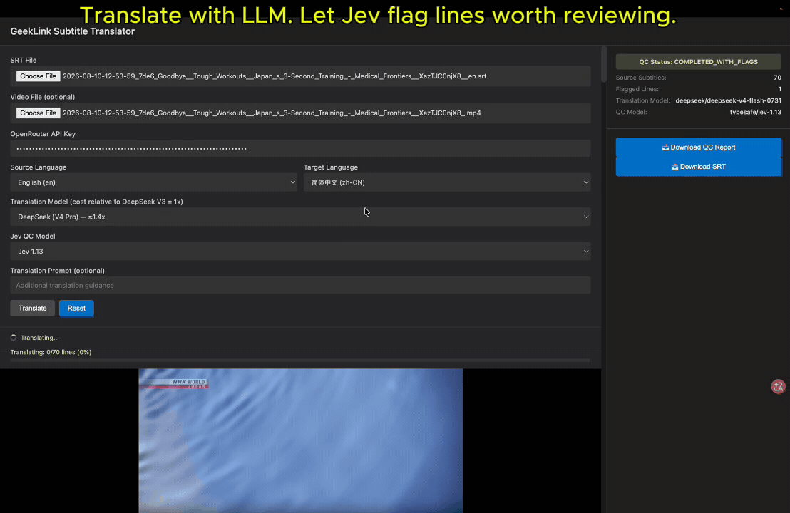

# GeekLink AI 字幕翻訳ツール（Jev 品質チェック付き）

[English](README.md) · [简体中文](README.zh-CN.md) · **日本語** · [한국어](README.ko.md)

LLM を活用したワークフロー向けの、オープンソースの SRT 翻訳・字幕品質チェックツールです。SRT ファイルを翻訳し、すべての字幕キューを保持したまま、Jev で翻訳を自動チェックできます。

**トピック：** SRT 翻訳 · 字幕 QC · 字幕 LLM · OpenRouter · Jev



GPT、Claude、Gemini、DeepSeek、Grok、またはその他の互換 OpenRouter モデルで SRT 字幕を翻訳できます。元の字幕の順序とタイムスタンプはそのまま保たれ、訳抜けや意味のずれが疑われる箇所はレビューしやすいよう明示されます。

## この字幕翻訳ツールを使う理由

- **好きな LLM で SRT 字幕を翻訳。** 言語ペア、品質要件、予算に合わせてモデルを選べます。
- **すべての字幕キューを保持。** 元の字幕番号、順序、タイムスタンプは変わりません。
- **気づかない訳抜けを防止。** 欠落した訳や空の訳は字幕 ID 単位で再試行され、解決しなかったものは明確にフラグ付けされます。
- **Jev による自動レビュー。** Jev は完成したすべての原文–訳文ペアをチェックし、人が確認すべき行をハイライトします。
- **公開前にレビュー。** 原文、訳文、レビュー状態を見比べてから、翻訳済み SRT と QC レポートをダウンロードできます。
- **ローカル Web UI と CLI に対応。** 対話的に使うことも、自動化された字幕ワークフローに組み込むこともできます。

> **SRT ファイルではなく動画から始めたいですか？**
>
> このオープンソースプロジェクトは、既存の SRT 字幕の翻訳とレビューに特化しています。[**GeekLink Subtitle Translator を試す →**](https://geeklink.dev/subtitle-translator/) なら、動画・音声の文字起こし、字幕翻訳、焼き付け字幕の抽出、結果の編集、完成動画の書き出しまで一通りこなせます。
>
> *Python のセットアップもモデル API の管理も不要です。*

## クイックスタート

**Python 3.10 以上**と **OpenRouter API キー**が必要です。macOS または Linux では：

```bash
git clone https://github.com/GeekLinkDev/jev-subtitle-translator.git
cd jev-subtitle-translator
bash run_web.sh
```

[http://127.0.0.1:8000](http://127.0.0.1:8000) を開き、次の手順で操作します：

1. **Translate + QC**（翻訳 + QC）または **QC existing translation**（既存の翻訳を QC）を選びます。
2. 原文の SRT をアップロードします。単独で QC する場合は、翻訳済み SRT もアップロードします。
3. OpenRouter API キーを入力し、翻訳元と翻訳先の言語を選びます。
4. **Translate + QC** または **Run QC** をクリックします。単独 QC では翻訳モデルは呼び出されません。
5. ハイライトされた行を確認し、JSON 形式の QC レポートをダウンロードします。翻訳モードでは翻訳済み SRT も取得できます。

動画ファイルは任意で、追加するとローカルで字幕をプレビューできます。

## 字幕の抜けを防ぐ仕組み

```text
SRT を解析し、すべてのキューを保持
        ↓
ID 付きのバッチで翻訳
        ↓
返された ID と空でない訳文を検証
        ↓
欠落または空の ID だけを再試行
        ↓
決定的チェックと Jev レビューを実行
        ↓
元のキューリストから SRT を再構築
```

SRT はローカルで解析され、元の字幕番号、順序、タイムスタンプは言語モデルへのリクエストに含まれません。各テキストキューには安定した ID が割り当てられ、JSON Schema による構造化出力で翻訳されます。

レスポンスごとに、翻訳ツールは想定どおりの ID を持ち、重複がなく、空でない訳文だけを受け入れます。40 件の字幕バッチから有効な結果が 35 件しか返らなかった場合、次のリクエストには未解決の 5 件だけが含まれます。最終的な SRT は元のキューリストから再構築されるため、1 件の翻訳失敗で後続の字幕がずれたり消えたりすることはありません。

それでも翻訳できない行は、出力内の位置に空の字幕として残り、失敗を隠すのではなく QC レポートで修正対象としてマークされます。

## Jev による翻訳品質の自動チェック

まずローカルの決定的チェックが、AI モデルを使わずに空の訳文や構造上の問題を検出します。その後 Jev が、残りの空でない原文–訳文ペアをすべてレビューし、**この訳は人による確認が必要か？** という一つの問いに答えます。

Jev は次のような欠陥の可能性をフラグ付けするよう指示されています：

- 意味の欠落、根拠のない追加、否定の反転。
- 人名、数字、日付、単位の変更や欠落。
- 途切れた内容、重複した内容、明らかに誤った内容。

QC は最大 40 キューの順序付きバッチで実行されます。あるキューを判定する前に、レビュー担当モデルは文や話者のターンに応じて、そのバッチ内の前後のキューを必要なだけ参照できます。意味がキューの境界をまたいで自然に移動している場合はフラグ付けされません。複数キューにまたがる文が全体として完全であれば、その範囲内のすべてのキューが合格となります。トークンの途中で単語が明らかに切れている場合は、前後の文脈から理解できても、確認すべき欠陥として扱われます。ルールは適合率（precision）優先です。判断に迷うものや単なる文体の違いは合格とし、本当に人の注意が必要な行にレポートを絞り込みます。

Jev のフラグは字幕を確認するための提案であり、誤りの証明ではありません。Jev は翻訳を書き換えず、誤りを見逃すこともあります。[レビュールール](src/jev_subtitle_translator/qc.py)と [OpenRouter へのリクエスト](src/jev_subtitle_translator/openrouter.py)はソースコードで確認できます。

## 対応する入力・モデル・出力

- **字幕形式：** SRT の入力と、翻訳済み SRT の出力。
- **翻訳モデル：** 厳密な JSON Schema 出力に対応した OpenRouter モデル。利用可能な GPT、Claude、Gemini、DeepSeek、Grok モデルを含みます。
- **言語：** 選択した翻訳モデルが対応する任意の言語ペア。
- **品質チェックモデル：** デフォルトは OpenRouter の `~typesafe/jev-latest` エイリアス。その他の OpenRouter モデルやローカルモデルにも変更できます。QC をオフにして決定的チェックだけを残すことも可能です。
- **ローカルモデル：** Ollama、LM Studio、vLLM、llama.cpp など、OpenAI 互換のサーバー。
- **レポート：** 翻訳済み SRT と、行ごとの翻訳状態・レビュー状態を含む JSON レポート。

## コマンドライン

SRT を翻訳し、Jev レビューを自動実行：

```bash
export OPENROUTER_API_KEY="your-api-key"

.venv/bin/jev-subtitle-translator translate input.srt \
  --source-language en --target-language de \
  --model openai/gpt-4o-mini --output translated.srt
```

再翻訳せずに既存の翻訳だけをレビュー：

```bash
export OPENROUTER_API_KEY="your-api-key"

.venv/bin/jev-subtitle-translator qc \
  --source input.srt --translation translated.srt \
  --source-language en --target-language de --output qc-report.json
```

翻訳コマンドは `translated.srt` と `translated.srt.qc.json` を出力します。追加の翻訳指示には `--prompt`、リクエストの調整には `--batch-size` と `--workers` を使い、すべてのオプションは各コマンドの `--help` で確認できます。

## ローカルモデルと OpenAI 互換モデル

翻訳と QC は、それぞれ OpenAI 互換の `/v1/chat/completions` エンドポイントを提供する任意のサーバーを指定できます。Web UI では **Local / OpenAI-compatible** を選び、base URL を入力します。例：Ollama は `http://localhost:11434/v1`、LM Studio は `http://localhost:1234/v1`、vLLM は `http://localhost:8000/v1`。

```bash
# ローカルで翻訳し、OpenRouter 上の Jev でレビュー
export OPENROUTER_API_KEY="your-api-key"
.venv/bin/jev-subtitle-translator translate input.srt \
  --source-language en --target-language de \
  --model qwen2.5:14b --base-url http://localhost:11434/v1 --output translated.srt

# 完全ローカル：ローカルモデルで翻訳とレビュー、OpenRouter キー不要
.venv/bin/jev-subtitle-translator translate input.srt \
  --source-language en --target-language de \
  --model qwen2.5:14b --base-url http://localhost:11434/v1 \
  --qc-model qwen2.5:14b --qc-base-url http://localhost:11434/v1 --output translated.srt
```

`OPENROUTER_API_KEY` が必要なのは openrouter.ai 上のエンドポイントを使う場合だけです。ローカルサーバーがキーを要求する場合は `LOCAL_API_KEY` を設定してください。Jev モデル（`typesafe/jev-*` と `~typesafe/jev-*`）は OpenRouter の Decisions エンドポイントを使うため、OpenRouter が必要です。その他の QC モデルは chat 経由で同じレビュールールを受け取り、行ごとに `needs_review` の判定を返します。セマンティック QC をスキップするには `--qc-model none` を使います。

翻訳ツールは JSON Schema による構造化出力を要求します。現在のローカルサーバーの多くはこれに対応しています。モデルが JSON をテキストや markdown で包んで返した場合も、オブジェクトは自動的に抽出されます。小規模なローカルモデルは ID を取りこぼすことが多い場合がありますが、そうした行も他の失敗と同様に再試行され、その後フラグ付けされます。

## よくある質問

### SRT のタイムスタンプは保持されますか？

はい。字幕番号、順序、タイムスタンプはローカルで解析・保存されます。翻訳に送られるのはセリフのテキストとその安定した ID だけです。

### 字幕の抜けをどう防いでいますか？

モデルのレスポンスはすべて、想定される字幕 ID と照合されます。欠落または空の結果は個別に再試行され、解決しなかった行は出力と QC レポートの中で見える状態のまま残ります。

### Jev は誤った翻訳を自動で修正しますか？

いいえ。Jev は人による確認が必要かもしれない字幕を特定するだけで、翻訳を置き換えたり書き換えたりはしません。

### この字幕翻訳ツールは無料ですか？

本プロジェクトは GPL のもとで無料かつオープンソースです。OpenRouter API キーはご自身で用意する必要があり、翻訳と Jev のリクエストには OpenRouter の料金が発生する場合があります。インターフェースはローカルで動作しますが、字幕テキストは OpenRouter と選択したモデルプロバイダーに送信されます。

### このプロジェクトと GeekLink の違いは？

本プロジェクトは既存の SRT ファイルの翻訳とレビューに特化しています。[GeekLink](https://geeklink.dev/subtitle-translator/) は、文字起こし、翻訳、焼き付け字幕の抽出、字幕編集、動画書き出しまでを備えた、クリエイター向けの本格的なデスクトップアプリです。

## 開発とライセンス

テスト用の依存関係は `.venv/bin/python -m pip install -e ".[dev]"` でインストールし、`.venv/bin/python -m pytest -q` を実行してください。修正や再現可能な字幕サンプルで貢献する方法は [CONTRIBUTING.md](CONTRIBUTING.md) をご覧ください。

ライセンスは [GPL-3.0-or-later](LICENSE) です。Copyright (C) 2026 GeekLinkDev.
