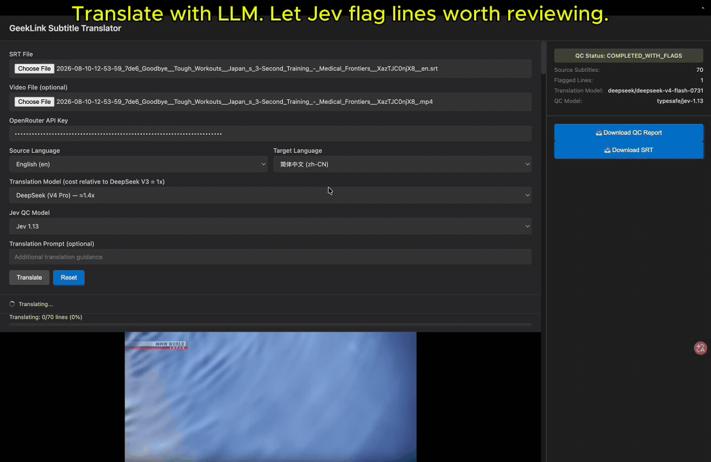

# GeekLink AI Subtitle Translator with Jev QC

An open-source SRT translator and subtitle QC tool for LLM-powered workflows. Use it to translate SRT files, preserve every subtitle cue, and automatically check translations with Jev.

**Topics:** SRT translator · subtitle QC · subtitle LLM · OpenRouter · Jev



Translate SRT subtitles with GPT, Claude, Gemini, DeepSeek, Grok, or another compatible OpenRouter model. The original subtitle order and timestamps stay unchanged, while missing translations and suspicious meaning changes are made visible for review.

## Why use this subtitle translator?

- **Translate SRT subtitles with your preferred LLM.** Choose the model that fits your language pair, quality requirements, and budget.
- **Preserve every subtitle cue.** Original subtitle numbers, order, and timestamps remain unchanged.
- **Prevent silent missing lines.** Missing or empty translations are retried by subtitle ID and clearly flagged if they remain unresolved.
- **Automatically review translations with Jev.** Jev checks every completed source–translation pair and highlights lines worth human review.
- **Review before publishing.** Compare the source text, translation, and review status, then download the translated SRT and QC report.
- **Use a local web interface or CLI.** Run the translator interactively or integrate it into an automated subtitle workflow.

> **Need to start from a video instead of an SRT file?**
>
> This open-source project is designed for translating and reviewing existing SRT subtitles. [**Try GeekLink Subtitle Translator →**](https://geeklink.dev/subtitle-translator/) for the complete workflow: transcribe video or audio, translate subtitles, extract burned-in subtitles, edit the results, and export finished videos.
>
> *No Python setup or model API management required.*

## Quick start

Requires **Python 3.10+** and an **OpenRouter API key**. On macOS or Linux:

```bash
git clone https://github.com/GeekLinkDev/jev-subtitle-translator.git
cd jev-subtitle-translator
bash run_web.sh
```

Open [http://127.0.0.1:8000](http://127.0.0.1:8000), then:

1. Choose **Translate + QC** or **QC existing translation**.
2. Upload the source SRT. For independent QC, also upload the translated SRT.
3. Enter your OpenRouter API key and choose the source and target languages.
4. Click **Translate + QC** or **Run QC**. Independent QC does not call a translation model.
5. Review highlighted lines and download the JSON QC report. Translation mode also provides the translated SRT.

A video file is optional and can be added for local subtitle preview.

## How it prevents missing subtitle lines

```text
Parse SRT and preserve every cue
        ↓
Translate ID-tagged batches
        ↓
Validate returned IDs and non-empty translations
        ↓
Retry only missing or empty IDs
        ↓
Run deterministic checks and Jev review
        ↓
Rebuild the SRT from the original cue list
```

The SRT is parsed locally, and its original subtitle numbers, order, and timestamps are kept outside the language model request. Each text cue receives a stable ID and is translated using JSON Schema structured output.

After every response, the translator accepts only expected IDs with unique, non-empty translations. If a batch of 40 subtitles returns only 35 valid results, the next request contains only the five unresolved subtitles. The final SRT is rebuilt from the original cue list, so one failed translation cannot shift or remove the subtitles that follow it.

If a line still cannot be translated, its position remains in the output as an empty subtitle and the QC report marks it for repair instead of hiding the failure.

## Automatic translation quality control with Jev

Local deterministic checks first detect empty translations and structural problems without using an AI model. Jev then reviews every remaining non-empty source–translation pair and answers one question: **Does this translation need human review?**

Jev is instructed to flag likely defects such as:

- Missing meaning, unsupported additions, or reversed negation.
- Changed or dropped names, numbers, dates, or units.
- Truncated, repeated, or obviously incorrect content.

A Jev flag is a suggestion to inspect a subtitle, not proof that it is wrong. Jev does not rewrite translations and can miss mistakes. The [review rules](src/jev_subtitle_translator/qc.py) and [OpenRouter requests](src/jev_subtitle_translator/openrouter.py) are available in the source code.

## Supported input, models, and output

- **Subtitle format:** SRT input and translated SRT output.
- **Translation models:** OpenRouter models that support strict JSON Schema output, including available GPT, Claude, Gemini, DeepSeek, and Grok models.
- **Languages:** Any source and target language pair supported by the selected translation model.
- **Quality-control model:** `typesafe/jev-1.13` by default.
- **Reports:** A translated SRT plus a JSON report containing line-level translation and review status.

## Command line

Translate an SRT and automatically run Jev review:

```bash
export OPENROUTER_API_KEY="your-api-key"

.venv/bin/jev-subtitle-translator translate input.srt \
  --source-language en --target-language de \
  --model openai/gpt-4o-mini --output translated.srt
```

Review an existing translation without translating it again:

```bash
export OPENROUTER_API_KEY="your-api-key"

.venv/bin/jev-subtitle-translator qc \
  --source input.srt --translation translated.srt \
  --source-language en --target-language de --output qc-report.json
```

The translation command writes `translated.srt` and `translated.srt.qc.json`. Use `--prompt` for additional translation guidance, `--batch-size` and `--workers` to tune requests, or either command's `--help` for all options.

## Frequently asked questions

### Does it preserve SRT timestamps?

Yes. Subtitle numbers, order, and timestamps are parsed and stored locally. Only the dialogue text and its stable ID are sent for translation.

### How does it prevent missing subtitle lines?

Every model response is validated against the expected subtitle IDs. Missing or empty results are retried separately, and unresolved lines remain visible in the output and QC report.

### Does Jev automatically fix incorrect translations?

No. Jev identifies subtitles that may need human review. It does not replace or rewrite the translation.

### Is the subtitle translator free?

The project is free and open source under the GPL. You provide your own OpenRouter API key, and translation and Jev requests may incur OpenRouter charges. The interface runs locally, while subtitle text is sent to OpenRouter and the model providers you select.

### What is the difference between this project and GeekLink?

This project focuses on translating and reviewing existing SRT files. [GeekLink](https://geeklink.dev/subtitle-translator/) is the complete creator-facing desktop app for transcription, translation, burned-in subtitle extraction, subtitle editing, and video export.

## Development and license

Install test dependencies with `.venv/bin/python -m pip install -e ".[dev]"` and run `.venv/bin/python -m pytest -q`. See [CONTRIBUTING.md](CONTRIBUTING.md) to contribute fixes or reproducible subtitle examples.

Licensed under [GPL-3.0-or-later](LICENSE). Copyright (C) 2026 GeekLinkDev.
